#### 0.项目进程

**“此作业为本队伍完全原创，Github项目于2022年3月4日创建，历时41天”**


#### 写在前面

虽然这是一个设计报告，但是我还是要在前面加一些感悟。目前互联网上类似的资源真的真的太多了，一开始我也有过疑问，也有过不理解，为什么要留这样一次作业，但这一切疑问，都在完成整个CPU之后，完全打消了，因为如果纯手工去设计一个CPU，对自己能力的提升真的是不可思议的。

**同时我们所有组员在此保证：本次作业代码100%手工原创，绝无任何从网上抄袭的嫌疑。**并在**作业提交之后**将对应的Github仓库转为**公开状态**，协议使用GPL3协议，供大家学习。地址：[wtyqqq/single_CPU (github.com)](https://github.com/wtyqqq/single_CPU)

不知不觉，从开始写这个单周期CPU到现在，已经有两个月有余了。从一开始学习chisel3，到后面转回Verilog；从一开始只会写简单的组合逻辑、分不清posedge到现在的完成了按照时序运行的单周期CPU，让我们这一组收获颇深。

其实如果要说这次作业的收获，应该是自己的代码水平和对于时序逻辑的理解了吧。

我是看王道考研的书入门的，本作业中涉及的基本知识来自于这本书，也正是按照这本书，我完成了大部分基础模块的设计，CU、IMEM、RegFile等等模块。这该可以算第一阶段了吧。 在第一阶段我完成了所有基本模块的设计，但是并没有为整个CPU封装。由于是课间写的，这个大概持续了一段时间，我陆陆续续提交了十几次commit。


第二个阶段，是封装了CPU的模块，这里主要参考的是之前学长们用chisel3设计的CPU，但是由于他们的是流水线设计，导致我的初步设计有了很多流水线的特性：比如IR，DR。虽然设计上有流水线的特性，但是我并不知道当时我的设计没有考虑时序约束，这也给我的后面测试带来了很大麻烦。这个阶段大概持续了十几天，十次commit。

第三个阶段，也是最痛苦的阶段，由于第二步的大饼，我设计了很多“现代”的模块，加上我设计的时序逻辑不是很好，在一开始甚至PC和NPC模块都无法运行，原因是我用了冲突的``` always@(posedge clk)```，导致PC和NPC在时序上锁死，这给了我沉重地打击….这个时候已经离提交没几天了，我按照时序逻辑，对着测试图一个一个debug，改到了深夜。


当天晚上我完成了简单的时序约束，于是后面几天我抓紧了时间，重新按照指令运行的时序逻辑重新设计了电路，在ddl前一天，运行成功了测试文件，虽然这个代码十分的简单，但是当时运行成功的时候，是十分激动的。

```assembly
addi $t0,$0,1 
addi $t0,$t0,2
addi $t0,$t0,3 
addi $t0,$t0,4 
addi $t0,$t0,5 
addi $t0,$t0,6
addi $t0,$t0,7 
addi $t0,$t0,8 
addi $t0,$t0,9 
addi $t0,$t0,10 
add $t0,$0,$t0
addi $0,$gp,0
sw $t0,10($gp)
lw $t1,10($gp)
j 2
```


在此期间，我对CPU做出了许多更改，比如对于某些模块，我们需要分别在clk上升沿和下降沿设置（即```always@(posedge clk)```和```always@(negedge clk)```），不然就会出现数据“卡住”的现象（如同多周期CPU那版，第一个周期的结果第二个周期才会出现）。还有对于imem的IP核设置，一开始我们并不会配置coe文件，一直读取不出来写好的指令，最后查询了对应的官方文档，配置好了指令的“memory_initialization_vector”项，顺利读取了指令……类似的状况出现了几十次，每一次的出现都能让我们对于CPU运行的原理理解更加深入。

篇幅限制不能写更多的废话了，在完成这次CPU后，我们小组更期待下次的多周期流水线CPU了，下面为我们的技术细节。

#### 1.评分标准与实现情况

<center>Judging Form</center>

| 评分项                                                       | 分值   | 实现情况                                              |
| ------------------------------------------------------------ | ------ | ----------------------------------------------------- |
| 1.基础要求                                                   | *70分* | -                                                     |
| 使用verilog语言                                              | -      | 使用Vivado编写的Verilog语言                           |
| 功能仿真成功                                                 | -      | 已前仿成功                                            |
| 给出性能指标                                                 | -      | CPI及时钟周期已给出，详见报告[第5项](#5.仿真测试结果) |
| MIPS指令集需覆盖R型，I型计算类等6种类型的指令                | -      | 已实现32条指令，详见报告[第3项](#3.模块介绍)          |
| 2.加分项                                                     | *30分* | -                                                     |
| 将C语言编写的简单程序交叉编译为汇编源码，并使用MIPS模拟器翻译为机器指令执行之（覆盖到CPU支持的分指令） | *15分* | 已完全实现，详见报告[第7项](#7.代码实现)              |
| 使用FPGA内部静态存储器将机器指令写入coe文件，将coe文件导入指令存储器（和数据存储器），仿真运行并观察数据存储器写回的的结果 | *15分* | 已完全实现，详见报告[第8项](#8.加分项一)              |


#### 2.总体设计

##### 2.1设计基本原理和架构：

单周期CPU指的是一条指令的执行在-一个时钟周期内完成，然后开始下一条指令的执行，即一条指令用一个时钟周期完成。电平从低到高变化的瞬间称为时钟上升沿，两个相邻时钟上升沿之间的时间间隔称为一个时钟周期。时钟周期一般也称振荡周期。在本实验的测试文件中，每个振荡间隔为10ns， 所以周期为20ns。

CPU在处理指令时，一.般需要经过以下几个步骤:
(1)取指令(IF):根据程序计数器PC中的指令地址，从存储器中取出一条指令，同时，PC根据指令字长度自动递增产生下一条指令所需要的指令地址，但遇到“地址转移”指令时，则控制器把“转移地址”送入PC，而转移的地址根据指令的不同又会有所不同。

(2)指令译码(ID):对取指令操作中得到的指令进行分析并译码，确定这条指令需要完成的操作和目的，从而产生相应的操作控制信号，用于驱动和指导执行状态中的各种操作。

(3)指令执行(EXE):根据指令译码得到的操作控制信号，具体地执行指令动作，然后转移到结果写回状态，一般是数值的计算，包括地址和数据等。

(4)存储器访问(MEM):所有需要访问存储器的操作都将在这个步骤中执行，包括存储器的读和写操作，根据该步骤给出存储器的数据地址，把数据写入到存储器中数据地址所指定的存储单元或者从存储器中得到数据地址单元中的数据。

(5)写回(WB):如果有相关要求，则指令会将执行的结果或者访问存储器中得到的数据写回相应的目的寄存器中。

##### 2.2单周期CPU指令处理过程示意图


##### 2.3单周期CPU数据通路图


#### 3.模块介绍

##### 3.1 ALU（算术逻辑单元）

（1）功能描述

 对接受到的两个操作数进行算术逻辑运算，其中具体运算的操作由接收到的操作码(ALU_OP)决定，将算术逻辑运算的结果输出，同时输出的还有 0 标志位。

（2）模块示意图(由Vivado RTL ANALYSIS生成)


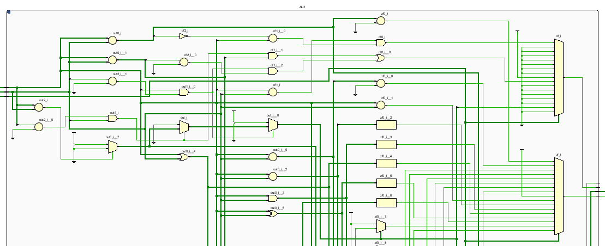

（3）模块接口

| 信号名      | 方向   | 描述                      |
| ----------- | ------ | ------------------------- |
| in1[31:0]   | input  | ALU的操作数1              |
| in2[31:0]   | input  | ALU的操作数2              |
| op[5:0]     | input  | 指示ALU执行指令的指令代码 |
| shamt[10:6] | input  | 移位位数                  |
| out[31:0]   | output | ALU的输出结果             |
| zf          | output | 零标志位                  |


##### 3.2 CU    （控制单元）

（1）功能描述

 对接受到的两个操作数进行算术逻辑运算，其中具体运算的操作由接收到的操作码(ALU_OP)决定，将算术逻辑运算的结果输出，同时输出的还有 0 标志位。

（2）模块示意图（部分）

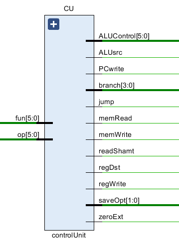

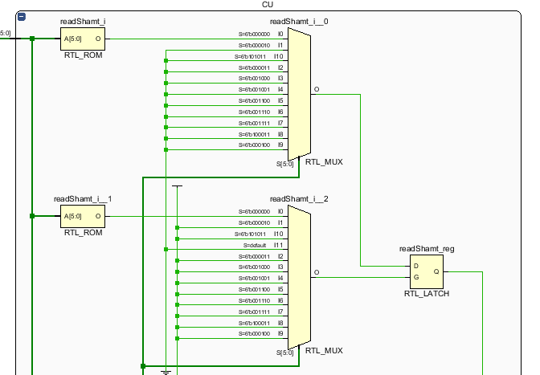

（3）模块接口

| 信号名      | 方向   | 描述                      |
| ----------- | ------ | ------------------------- |
| in1[31:0]   | input  | ALU的操作数1              |
| in2[31:0]   | input  | ALU的操作数2              |
| op[5:0]     | input  | 指示ALU执行指令的指令代码 |
| shamt[10:6] | input  | 移位位数                  |
| out[31:0]   | output | ALU的输出结果             |
| zf          | output | 零标志位                  |

##### 3.3 IMEM   （指令存储器）

（1）功能描述

IM(Instruction Memory)指令寄存器是组合逻辑，内部设计为含有 128 个字的ROM。在 IM 中存储的是 MIPS 指令的机器码。机器码的生成借助于 MARS 软件，在其中编写 MIPS 汇编代码之后即可转成相应的机器码。该模块由两个接口，分别是访问 IM 的地址，输出接口则是地址对应的数据(指令)。在整个电路模拟仿真的初始化时，需要借助 Verilog HDL 的$readmemh 函数将目的文件中的数据(一般是工程文件中的.dat 文件)读入 IM。

（2）模块示意图

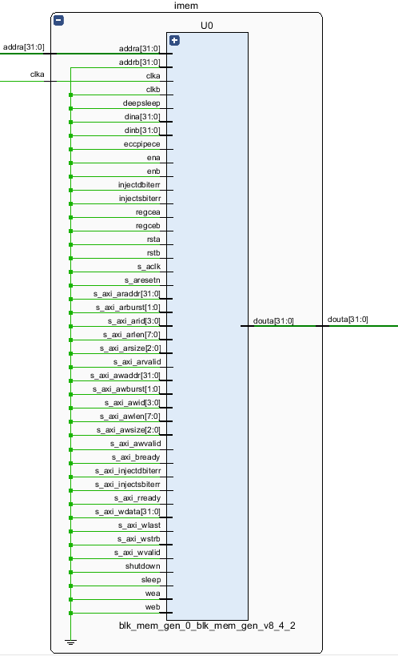

（3）模块接口

| 信号名     | 方向   | 描述                           |
| ---------- | ------ | ------------------------------ |
| clk        | input  | clk 上升沿时写入；下降沿时读出 |
| addr[31:0] | input  | 输入信号的访问位置             |
| outp[31:0] | output | IMEM输出的指令数据             |


##### 3.4 DMEM   (数据存储器)

（1）功能描述

DMEM(数据存储器):DM是数据存储器，主要功能是根据读写控制信号DMWr，读写对应addr地址的32位数据。

（2）模块示意图

.png)

（3）模块接口

| 信号名       | 方向   | 描述                                        |
| ------------ | ------ | ------------------------------------------- |
| clk          | input  | clk 上升沿时写入；下降沿时读出              |
| RE           | input  | 读使能信号，允许输出数据至缓冲器。          |
| WE           | input  | 写使能，允许将数据、地址或指令写入数存 之中 |
| addr1[31:0]  | input  | 写寄存器的位置                              |
| input[31:0]  | input  | DMEM的输入数据                              |
| output[31:0] | output | DMEM的输出数据                              |


##### 3.5 PC    （程序计数器）

（1）功能描述

由（2）模块示意图所示，PC 模块控制当前读取的指令，通过对 PC 值的更迭，实现 MIPS 代码要求实现的逻辑顺序。当然，在一个周期内，PC 总是能够根据所取指令的正确要求，实现 PC 的更迭：一般情况下增加 4，若分支结构发生，则跳转到目的分支地址，同理，跳转指令条件下，PC 发生跳转。

（2）模块示意图

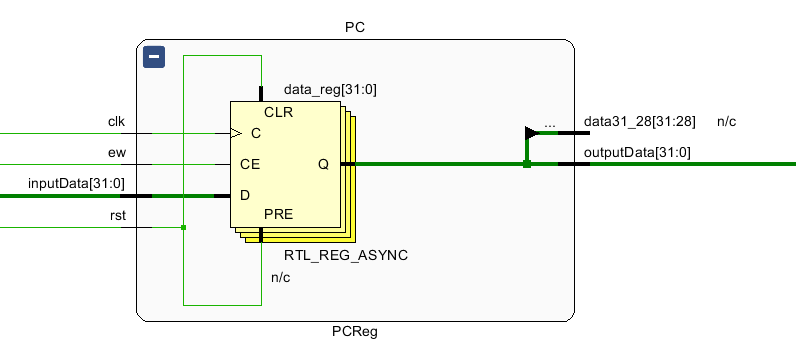

（3）模块接口

| 信号名           | 方向   | 描述                                                         |
| ---------------- | ------ | ------------------------------------------------------------ |
| clk&rst          | input  | clk信号或rst信号为上升沿时，若rst信号为1，则重置data（PC）的值，若ew为1，将inputData写入data（PC）。 |
| inputData[31:0]  | input  | 输入的将要更改的PC值                                         |
| ew               | input  | 当ew信号为1，开启写入数据                                    |
| outputData[31:0] | output | 输出的更改过后的PC值                                         |


##### 3.6 RegFile    （寄存器文件）

（1）功能描述

寄存器组文件(register file)用来存储 MIPS 指令集中 32 个寄存器，作为一个单独的模块，通过读写端口输入的地址和数据来更新寄存器的内容。其中寄存器读是组合逻辑的功能，而写寄存器堆是时序逻辑，前者用 assign 赋值，而后者则需要在时钟的边沿触发写入（always@）。

（2）模块示意图（部分）

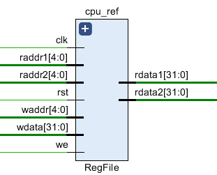

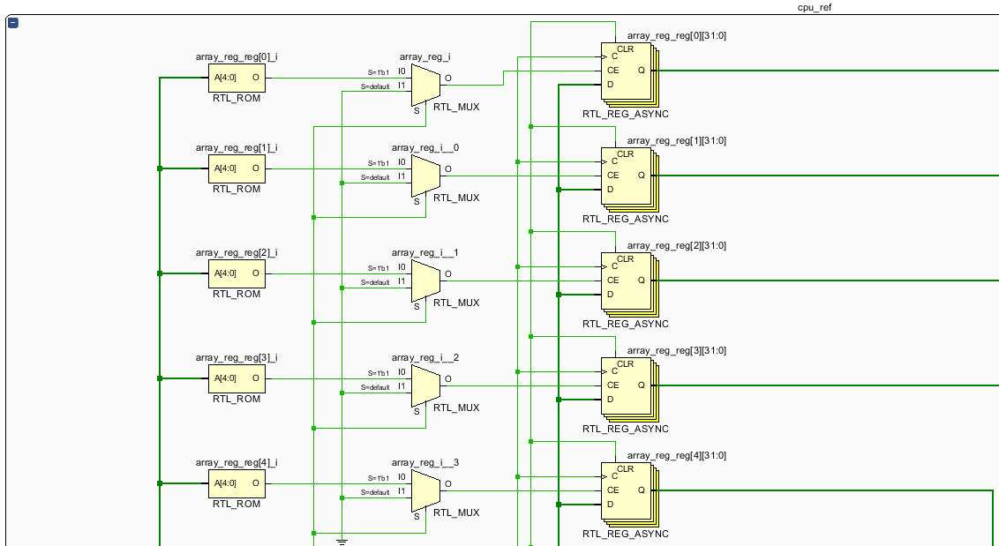

（3）模块接口

| 信号名       | 方向   | 描述                                   |
| ------------ | ------ | -------------------------------------- |
| clk          | input  | clk 上升沿时，开始写入工作。           |
| rst          | input  | Rst 上升沿时，将寄存器组内容全部置零。 |
| we           | input  | 若 we信号为 1， 则数据成功写入         |
| raddr1[4:0]  | input  | 读寄存器端口 1 的地址                  |
| raddr2[4:0]  | input  | 读寄存器端口 2 的地址                  |
| waddr[4:0]   | input  | 写寄存器端口的地址                     |
| wdata[31:0]  | input  | 写寄存器端口的数据                     |
| rdata1[31:0] | output | 读寄存器端口 1 的数据                  |
| rdata2[31:0] | output | 读寄存器端口 2 的数据                  |


##### 3.7 MUX （数据选择器）

（1）功能描述

数据选择器是电子电路中常见的逻辑器件，在单周期CPU的数据通路里出现多次，因为数据选择器涉及的数据大小以及选项的多寡皆有不同，在（3）中我们给出三种规格(MUX、spMUX、MMUX) 的模块接口。数据选择器的功能为根据输入的控制信号的不同，从不同的输入中选择合适的输出。

（2）模块接口与示意图

（Ⅰ）MUX

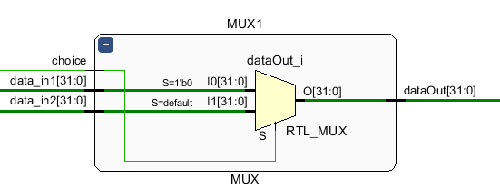

| 信号名         | 方向   | 描述      |
| -------------- | ------ | --------- |
| choice[1:0]    | input  | 选择信号  |
| data_in1[31:0] | input  | 写入数据1 |
| data_in2[31:0] | input  | 写入数据2 |
| dataOut1[31:0] | output | 输出数据  |

（Ⅱ）spMUX

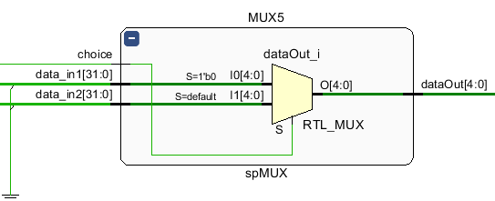

| 信号名         | 方向   | 描述      |
| -------------- | ------ | --------- |
| choice[1:0]    | input  | 选择信号  |
| data_in1[31:0] | input  | 写入数据1 |
| data_in2[31:0] | input  | 写入数据2 |
| dataOut1[4:0]  | output | 输出数据  |

（Ⅲ）MMUX

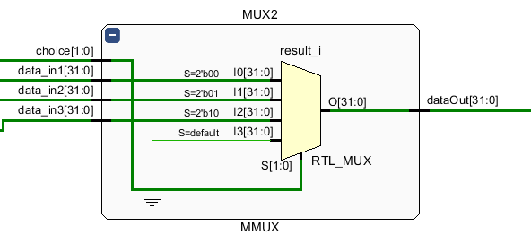

| 信号名         | 方向   | 描述      |
| -------------- | ------ | --------- |
| choice[1:0]    | input  | 选择信号  |
| data_in1[31:0] | input  | 写入数据1 |
| data_in2[31:0] | input  | 写入数据2 |
| data_in3[31:0] | input  | 写入数据3 |
| dataOut1[31:0] | output | 输出数据  |


##### 3.8 EXT （数据拓展器）

（1）功能描述

同数据选择器一样，数据拓展器同样是电子电路中常用的逻辑模块，在单周期和流水线 CPU 中均有所

作用，功能是：将输入的 16 位立即数，通过控制信号，将其零拓展或者符号拓展并且输出。同MUX一样，我们设计了三种不同规格的数据拓展器（Ext5，Ext16，Ext18）以灵活满足需要。

（2）模块接口与模块示意图

（Ⅰ）Ext5

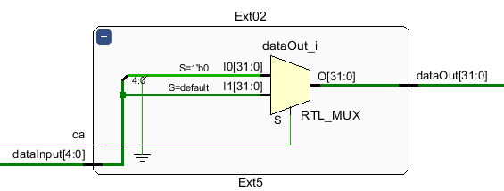

| 信号名         | 方向   | 描述                                          |
| -------------- | ------ | --------------------------------------------- |
| ca             | input  | 控制信号，ca为1时进行符号拓展，否则进行零拓展 |
| dataInput[4:0] | input  | 输入的5位立即数                               |
| dataOut1[31:0] | output | 拓展之后得到的32位立即数                      |

（Ⅱ）Ext16

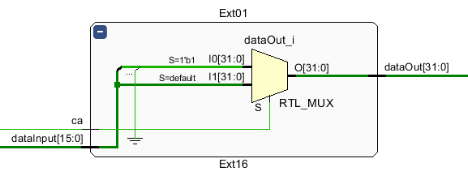

| 信号名          | 方向   | 描述                                          |
| --------------- | ------ | --------------------------------------------- |
| ca              | input  | 控制信号，ca为1时进行符号拓展，否则进行零拓展 |
| dataInput[15:0] | input  | 输入的16位立即数                              |
| dataOut1[31:0]  | output | 拓展之后得到的32位立即数                      |


#### 4.指令集（共32条）

##### 4.1 R型指令（共17条）

add，addu, sub, subu, and, or, xor, nor, sll, srl, sra,sllv, srlv,srav, jr, slt, sltu

| OpCode    | rs   | rt   | rd   | shamt | FuncCode |
| --------- | ---- | ---- | ---- | ----- | -------- |
| 6(000000) | 5    | 5    | 5    | 5     | 6        |


##### 4.2 I型指令 （共13条）

addi, addiu, andi, ori, xori, lui,lw,se,beq, bne, bgtz,slti,sltiu

| OpCode | rs   | rt   | immediate |
| ------ | ---- | ---- | --------- |
| 6      | 5    | 5    | 16        |

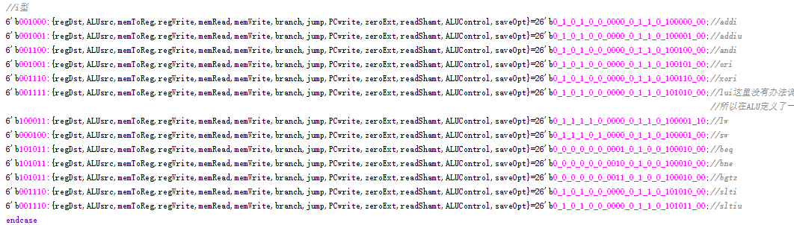

##### 4.3 J型指令（共2条）

j，jal

| OpCode | address |
| ------ | ------- |
| 6      | 26      |

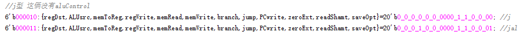


#### 5.仿真测试结果

5.1 CPU test

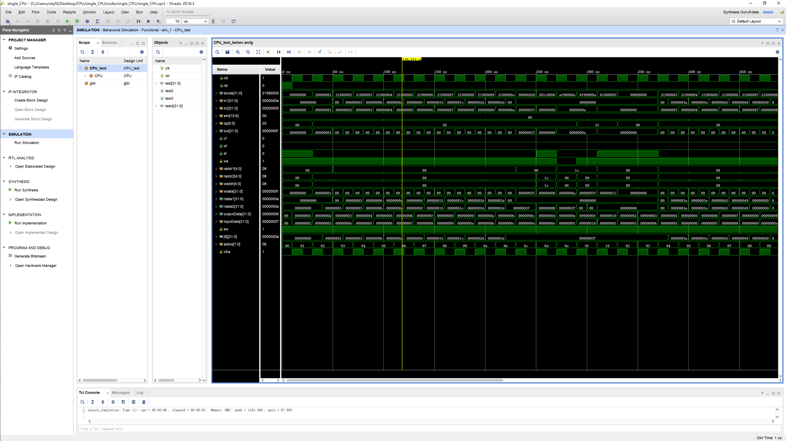

##### 5.1 PC test

30ns时，输入32'b1，50ns时，输入32'b070ns时，输入32'b1，并将ew置0

测试结果(outputData)：


##### 5.2 Regfile test

第一个时钟周期时（即计时起20ns），write enable置0，第一个输入raddr1赋0

40ns，第二个输入raddr2赋5'b00001；60ns，raddr2赋值5'b00010；80ns，raddr2赋值5'b00100；100ns，raddr2赋值5'b01000; 120ns，write enable置1，wdata 赋值5'b00001，waddr置 0；140ns，输入5'b10000；140ns，write enable置1，wdata 赋值5'b0000，waddr置 1

测试结果(rdata1,rdata2)：


##### 5.3  ALU test

测试结果(out, cf,of,zf)：

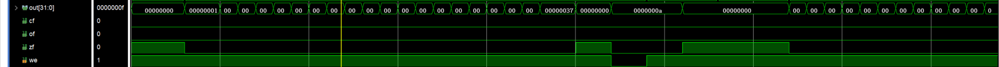


##### 5.4 MUX test

(1)MUX & SPMUX（测试参数一致）

两个输入值分别为：

32'b0000_1001_0000_0000_0000_0000_0000_0000，                     32'b0000_0110_0000_0000_0000_0000_0000_0000 

第一个周期choice置0，第二周期choice置1

测试结果：

(2)MMUX

三个输入值分别为：

32'b0000_0000_0000_0000_0000_0000_0000_1001，

32'b0000_0000_0000_0000_0000_0000_0000_0110，

32'b0000_0000_0000_0000_0000_0000_0000_0101

第一个周期choice置0，第二周期choice置1

测试结果(douta):

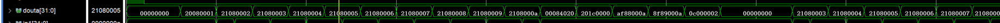

##### 5.5 32位加法器测试

第一个时钟周期，第一个输入值为5'b00100，第二个输入值为5'b00110;

测试结果(out)：


#### 6.性能指标分析

##### 6.1 CPI

参考课件，我们可以知道，CPI计算公式为
$$
CPI=\frac{CPU时钟周期数}{指令条数}
$$
显而易见，在我们的单周期CPU上，一个时钟周期只运行一条指令，因此我们可以得到CPI =1 。


##### 6.2 等效频率

参考课件，我们可以知道，等效频率的计算公式为
$$
等效频率 = \frac{1}{时钟周期}
$$
我们的单周期CPU时钟周期为20ns，则等效频率为50MHZ 。

#### 7.代码实现

见codes文件夹

#### 8.加分项一

##### 8.1 技术实现

这里我们测试的代码为优化过的递归版斐波那契数列，代码详见图 2。然后我们使用 mips-linux-gcc 工具交叉编译，见图。编译完之后，我们需要对一些内容进行修改，比如 

**1)** printf 函数和 scanf 函数转换成汇编后存在字符串解析，拼接等等操作，导致过于复杂，我们需要手动将写代码写为调用 POSIX 规范的输入输出接口。

**2)** 编译出来的汇编代码是分别用堆栈寄存器 sp,gp 指向堆栈来存储全局变量（一般在 data 段（可以不严谨的理解为堆段））和局部变量（一般在栈段），我们在 Mars 上运行的时候，需要手动指定这些变量。

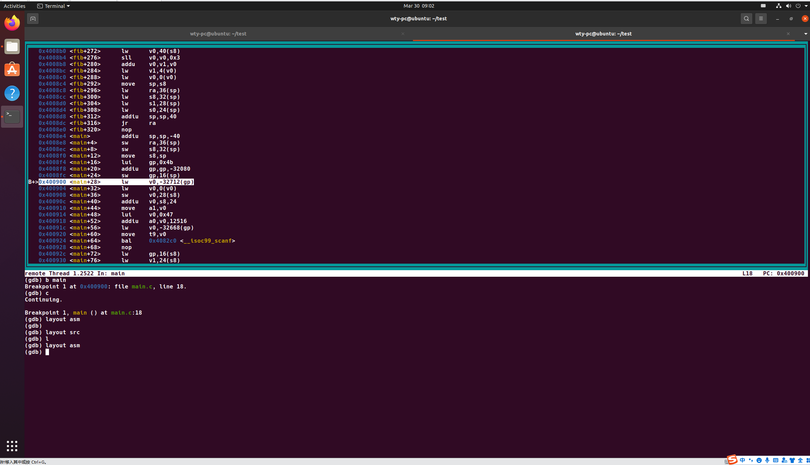


##### 8.2运行截图

在处理好各种问题之后，我们获得了一个名为“fibWithCache.asm”的文件，如图 3 所示。然后在 Mars 直接打开这个文件，运行。

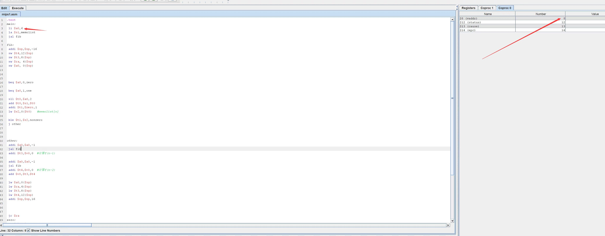


#### 9.加分项二

使用FPGA内部静态存储器，将机器指令写入coe文件，将coe文件导入指令存储器（和数据存储器），仿真运行，并观察数据存储器写回的的结果

对于这项要求，我们使用ip核代替了原本的IMEM，我们将已经写好的二进制指令放入coe文件的vector项里面，并将radix设置为2，表示输入为2进制

##### 9.1设置

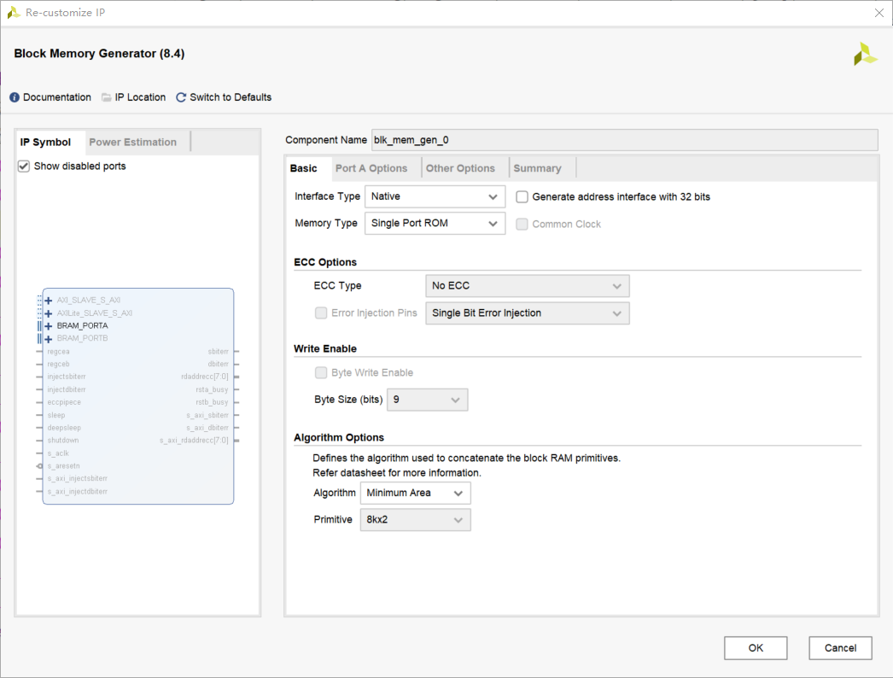


##### 9.2Coe文件设置

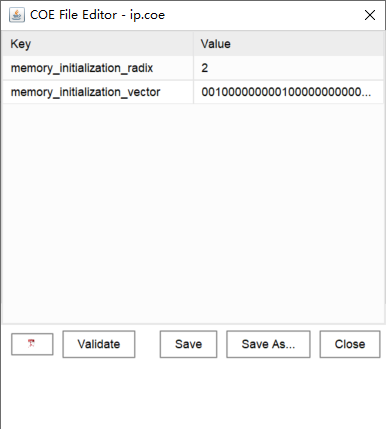


##### 9.3Coe文件

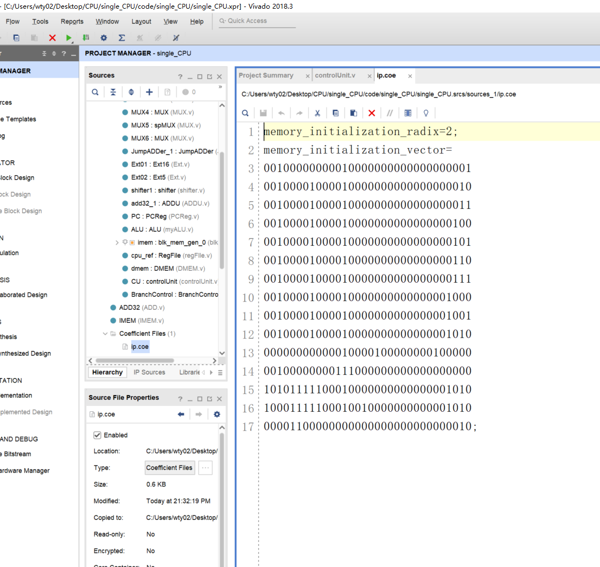


#### 10.总结

此次作业，我们基本实现了mips指令集的功能。
